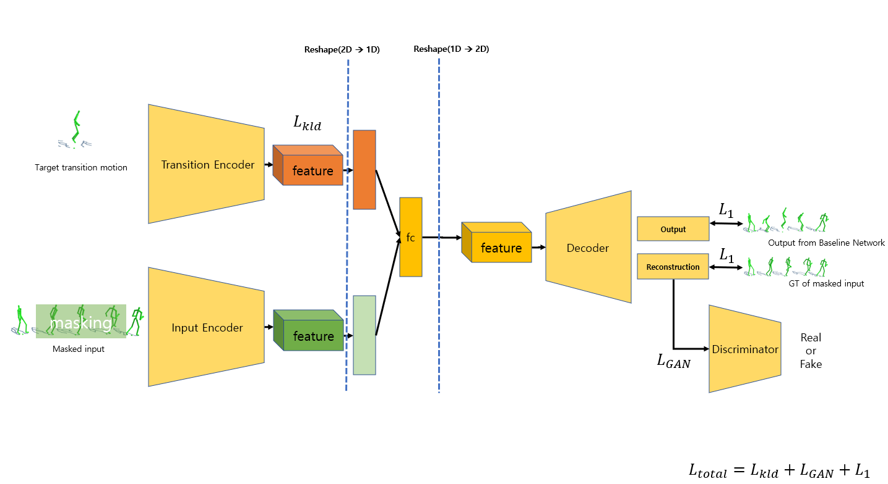
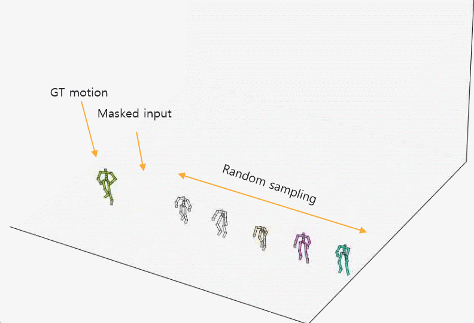
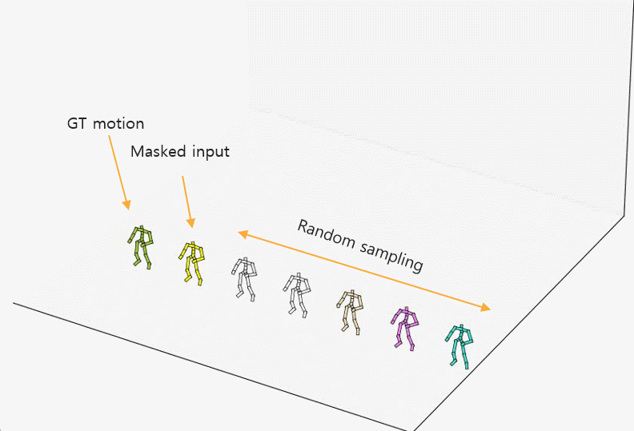
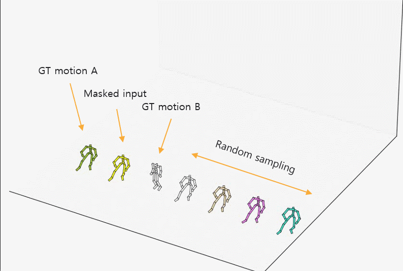
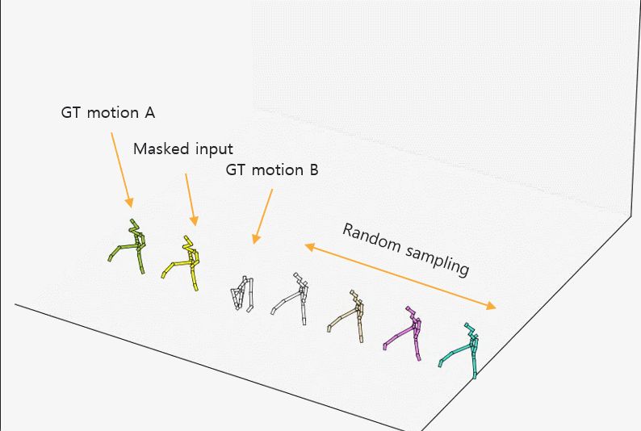

# Content controllable motion infilling version 2 (+ random sampling)

Motion infilling into target content:

The [Baseline](https://arxiv.org/abs/2010.11531)(Convolutional Autoencoders for Human Motion Infilling, 3DV 2020) can generate only one determined output from one input. But, there are many possible cases between keyframes. Therefore, this project conducted for making its output various with conditional input.
In this version, the motion can be generated from randomly sampled vector in feature space of Transition Encoder.

Additional: Baseline Implementation[(Here, Pytorch)](https://github.com/rlgnswk/Motion-Infilling-pytorch-version-implementation) 

-----------------

## Overall Structure:

  

## Result (random sampling the feature space of Transition Encoder - Sampling distribution: N(0,2)):

  
  
   

## Result (motion A - random transition - motion B):

  
  
   

