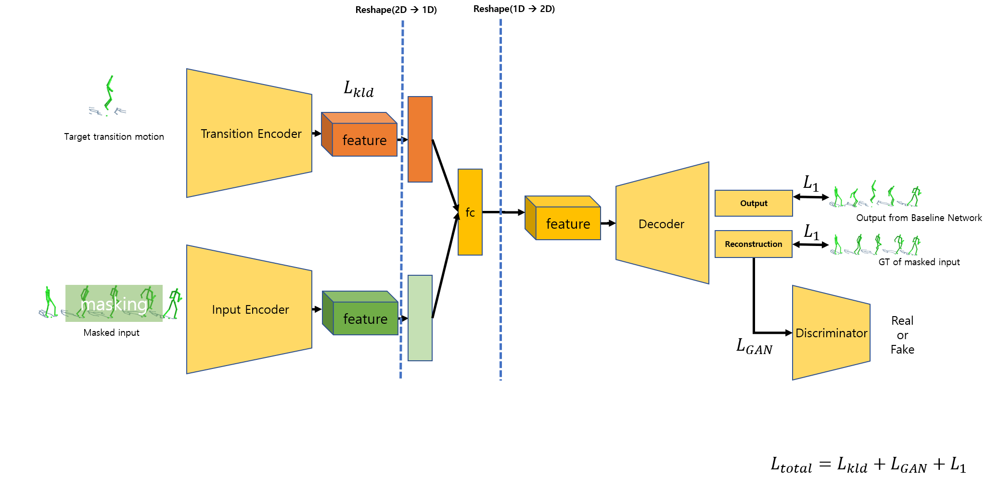

# Content controllable motion infilling version 2(latent space random sampling)

Motion infilling into target content:

The [Baseline](https://arxiv.org/abs/2010.11531)(Convolutional Autoencoders for Human Motion Infilling, 3DV 2020) can generate only one determined output from one input. But, there are many possible cases between keyframes. Therefore, this project conducted for making its output various with conditional input.

Additional: Baseline [Implementation(pytorch version)](https://github.com/rlgnswk/Motion-Infilling-pytorch-version-implementation) 

-----------------

## Overall Structure:
<p float="center">
  

</p>


## Result:
<p float="center">
  
  
   
</p>


## Result(latent interpolation):
<p float="center">
  
  
   
</p>

----------
# Usage:

## Data

1. Get data from [Holden et al](https://theorangeduck.com/page/deep-learning-framework-character-motion-synthesis-and-editing)
2. Pre-pocessing by using code from [Kaufmann et al](https://github.com/eth-ait/motion-infilling/tree/be814cfe971ec58d0e66c7644db3cdc89f71d092)


## Run on the code:

### Training

```
python train_blending_GAN_controallable.py --name <name_of_experiment> --datasetPath <your_train_data_path> --ValdatasetPath <your_valid/test_data_path> 
```

The results will save in ```<Code_path>/experiments(default)/```

You can check the default setting and use it from line 29 to 37 ```<Code_path>/train_blending_GAN_controallable.py```


### Test

The pretrained model is provided at "<Code_path>/pretrained/"

We provide pretrained model "model_399.pt" at "./pretrained" folder, check it if you want.

```
python test.py --name <name_of_experiment> --ValdatasetPath <your_valid/test_data_path> --model_pretrained_modelpath <trained_model_path>
```
The results will save in ```<Code_path>/experiments(default)/```

### Visualization

The visualization codes are referd from [Here](https://github.com/eth-ait/motion-infilling/tree/be814cfe971ec58d0e66c7644db3cdc89f71d092)

```
cd <Code_path>/VisualizationCode ; python view.py --name <name_of_experiment> --epoch <num of epoch(train)/iter(test)>
```


# Reference
Reference [Paper](https://arxiv.org/abs/2010.11531)(3DV 2020)

Official [Github](https://github.com/eth-ait/motion-infilling/tree/be814cfe971ec58d0e66c7644db3cdc89f71d092) (Tensorflow) of reference paper

